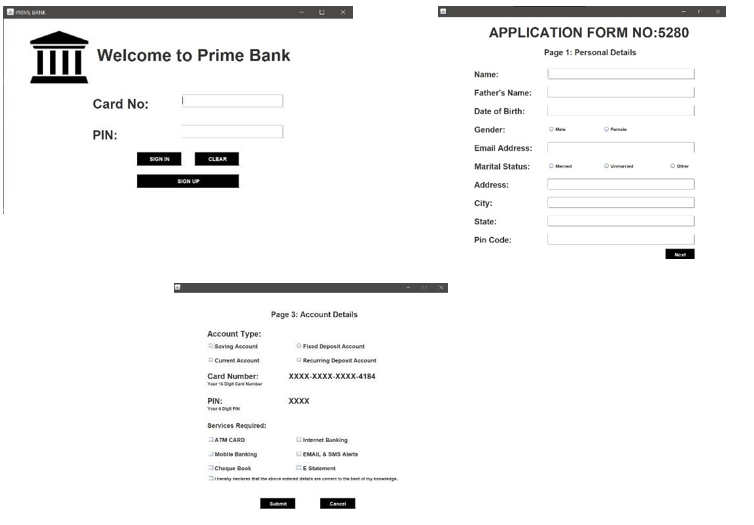
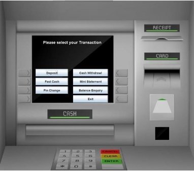
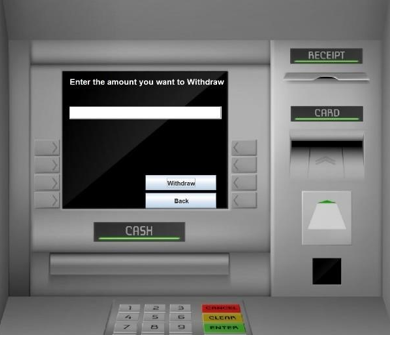

# GUI-Based Banking Management System

### Course: Object-Oriented Programming (OOP) , Database Systems
### Languages & Technologies: Java, Oracle Database

---

## Project Overview
The **GUI-Based Banking Management System** is a Java-based desktop application with a graphical user interface (GUI) created using Java Swing. It integrates with an Oracle Database to provide a seamless and efficient banking experience, implementing core functionalities like account management, transaction processing, and administrative controls.

---

## Features
- **Account Management:** Create, update, and delete customer accounts.
- **Transaction Processing:** Process deposits, withdrawals, and transfers with real-time balance updates.
- **Customer Management:** Securely view and update customer information.
- **Administrative Tools:** User access control and logging features for secure operations.

---

## GUI Highlights
- Developed with **Java Swing** for a user-friendly and interactive interface.
- Structured layouts using `GridLayout`, `BorderLayout`, and `FlowLayout`.
- Implemented responsive event handling with `ActionListener`.

---

## How to Run
1. **Prerequisites:**
   - **Java JDK 8+**
   - **Oracle Database**
   - **Eclipse IDE** with Java development tools installed.
2. **Setup Steps:**
   - Clone the repository:
     ```bash
     git clone <https://github.com/Rabbia-Noor/-GUI-Banking-System.git>
     cd GUI-Banking-System
     ```
   - Open the project in **Eclipse IDE**.
   - Configure the **Oracle Database**:
     - Update database connection details (e.g., `username`, `password`, and `connection URL`) in the source code.
3. **Run the Application:**
   - Run the `Main.java` file to launch the application.
   - Use the GUI to perform banking operations.

---
### **Login and Registration Form  Window**

## Screenshots
### **Transaction Window**


### **Withdrawal Window**


---

## Learning Outcomes
- **Object-Oriented Programming (OOP):** Utilized principles like inheritance, encapsulation, and exception handling in Java.
- **GUI Development:** Designed interactive user interfaces with Java Swing.
- **Database Integration:** Connected Java applications with Oracle Database for backend operations.
- **Error Handling:** Implemented robust error handling for input validation and exceptions.

---

## Challenges Faced
- Establishing secure connections with Oracle Database.
- Implementing user-friendly designs for complex banking operations.
- Handling concurrent operations like multiple transactions efficiently.

---

